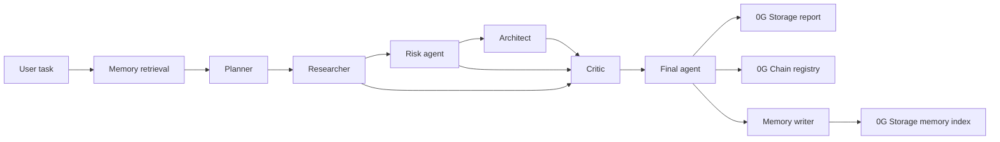

# ClawMind

ClawMind runs multi-agent Web3 due diligence and anchors the final report on 0G Chain, so audit results can be checked later instead of silently rewritten.

## Live Links

| Surface | URL |
|---|---|
| Live app | https://clawmind-puce.vercel.app |
| Run analysis | https://clawmind-puce.vercel.app/analysis |
| Judge mode | https://clawmind-puce.vercel.app/judge |
| Public stats | https://clawmind-puce.vercel.app/stats |
| Judge API | https://clawmind-puce.vercel.app/api/judge |
| MCP server | https://clawmind-mcp.vercel.app/mcp |
| OpenClaw manifest | https://clawmind-puce.vercel.app/api/openclaw/manifest?format=json |
| 0G contract | https://chainscan.0g.ai/address/0x08a9c275f5d0764a32f9dda4f50ba6f9a828e2b1 |

## Live Proof Snapshot

Current live evidence is exposed at `/stats` and `/api/judge`: signed registry writes, recent on-chain analyses, runtime memory growth, critic effectiveness, and MCP usage are all available as public UI and JSON.

## Traction

Early usage is visible on the public dashboard and Judge API. Latest observed live stats during hackathon testing:

| Signal | Current evidence |
|---|---:|
| 0G Chain registry entries | 37 analyses recorded on 0G mainnet |
| Signed registry writes | 100% of current registry metrics are EIP-712 operator verified |
| 0G-backed memory records | 18 total memory records |
| Runtime-generated memory | 15 records generated by live analyses |
| MCP usage | 1 signed analysis initiated through the MCP surface |
| Critic activity | 62 challenges across 16 tracked runs |

These numbers are intentionally exposed in `/stats` and `/api/judge` so judges can verify the project is not a static demo.

## Problem

DAO contributors, protocol teams, and Web3 investors often review projects through scattered notes, subjective risk calls, and reports that are hard to reproduce later. That makes it difficult to explain why a protocol was approved, rejected, or sent back for more work. ClawMind turns that process into an auditable pipeline: multiple agents analyze the task, a Critic challenges weak assumptions, and the final result is stored with verifiable 0G receipts.

## How It Works



The pipeline has 8 steps: memory retrieval, planner, researcher, risk agent, architect, critic, final agent, and memory writer. The Final Agent applies explicit score anchors and critic penalties, so a high-risk custody task can become `NO_GO`, a mature audited protocol can become `GO`, and ambiguous protocol evidence can stay `INVESTIGATE_MORE`.

The Critic is not cosmetic. Its unresolved challenges are counted by severity and reflected in the final report:

| Challenge severity | Score adjustment |
|---|---:|
| High | -15 |
| Medium | -7 |
| Low | -3 |

The UI shows how many challenges were raised, how many were resolved, and how the final score changed.

## 0G Integration

| Component | Use in ClawMind | Proof |
|---|---|---|
| 0G Compute | Routes agent inference through 0G Router using `deepseek/deepseek-chat-v3-0324`. | Judge API: `compute.active` |
| 0G Storage - reports | Stores final report JSON and returns a root hash plus `0g://` URI. | In-app decision receipt |
| 0G Storage - memory | Stores the persistent memory index used by future runs. | Memory index receipt |
| 0G Chain | Records report hash, score, recommendation, storage URI, and the EIP-712 operator signature in `AnalysisRegistry.sol`. | Contract `0x08a9c275f5d0764a32f9dda4f50ba6f9a828e2b1` |
| OpenClaw manifest | Describes the 8-step agent pipeline, artifacts, and security policies. | `/api/openclaw/manifest?format=json` |

## Contract History

The Judge API and production app always point to the current signed registry.

| Version | Address | Status | Purpose |
|---|---|---|---|
| v3 current | `0x08a9c275f5d0764a32f9dda4f50ba6f9a828e2b1` | Active | Production registry with EIP-712 operator signatures |
| v2 | `0x01c9d988cbC2c369CB18B952C01a5Da05bF034D2` | Historical | Earlier open-write registry used before operator authentication |
| v1 | `0x8d53153a8a25c81701954eed66154b3ebba8b8c7` | Historical | Earliest registry prototype |

Only the v3 registry is used by `/api/judge`, `/stats`, `/analysis`, and the MCP flow. Production is configured with `ZERO_G_ALLOW_LEGACY_REGISTRY_WRITES=false`.

## Verification Checklist

| Check | How to verify |
|---|---|
| Contract address is consistent | Open the 0G explorer link above and compare it with `/api/judge` and `.env.example`. |
| Pipeline has 8 steps | Open `/api/judge` and check `pipelineSteps: 8`. |
| Scores are calibrated | Run the example test tasks and inspect `/api/judge` for varied scores and recommendations. |
| Semantic memory is active | Open `/api/judge` and check `memory.semanticRetrievalActive: true`. |
| Reports are persisted | Run an analysis and check the decision receipt for `provider: "0G_STORAGE"` and a `0g://` URI. |
| On-chain anchoring works | Run an analysis and open the transaction from the on-chain receipt. |
| Submitter is authenticated | In the on-chain receipt or Judge Mode, check for `SIGNED_OPERATOR` and a verified operator signature. |
| Integrity is checkable | Compare the report hash in the UI with the hash stored on 0G Chain. |
| Critic affects the result | Run a high-risk custody task and inspect the Adversarial Panel plus final score adjustment. |

## Example Test Tasks

Use these to check that scoring is not collapsing to one value:

| Task | Expected result |
|---|---|
| `Review a read-only Web3 analytics dashboard for Uniswap pools. It uses public indexed data only, has no wallet connection, no transaction signing, no custody, no admin keys, and no ability to move funds.` | `GO`, score around 75-90 |
| `Self-custodial agent that auto-trades user funds with no withdrawal guards and a private key in an env var.` | `NO_GO`, score around 10-25 |
| `New AMM with novel TWAP oracle, audited by 1 firm, $5M TVL, anonymous team.` | `INVESTIGATE_MORE`, score around 35-60 |
| `asdf qwerty` | Refusal or very low score |
| `Upgradeable cross-chain bridge with admin key rotation, delayed oracle fallback, and $20M planned TVL.` | Edge case requiring investigation |

## Safety Model

ClawMind reviews Web3 projects; it does not execute transactions, manage user funds, or replace a human security audit. The LLM pipeline produces structured due diligence, while storage receipts and on-chain hashes make the result easier to verify later. Any deployment that touches custody, signing keys, protocol upgrades, or automated execution should still require deterministic policy gates and human approval outside the model.

## Limitations

- ClawMind is a due-diligence aid, not a formal audit or exploit detector.
- Public task text is weaker than source code, docs, tests, and deployment config.
- On-chain integrity proves the report hash was recorded; it does not prove the report is correct.
- If the registry address changes, production must keep `ZERO_G_ANALYSIS_REGISTRY_ADDRESS` pointed at a signed registry before claiming operator-authenticated writes.

## Setup

```bash
git clone https://github.com/ILYUTKICK/clawmind.git
cd clawmind
npm install
cp .env.example .env
npm run dev
```

Required production variables:

```bash
ZERO_G_NETWORK=mainnet
ZERO_G_COMPUTE_ENDPOINT=https://router-api.0g.ai/v1/chat/completions
ZERO_G_COMPUTE_API_KEY=your_0g_mainnet_router_api_key
ZERO_G_COMPUTE_MODEL=deepseek/deepseek-chat-v3-0324
ZERO_G_STORAGE_ENABLED=true
ZERO_G_STORAGE_PRIVATE_KEY=your_mainnet_wallet_private_key
ZERO_G_ANALYSIS_REGISTRY_ADDRESS=0x08a9c275f5d0764a32f9dda4f50ba6f9a828e2b1
ZERO_G_ALLOW_LEGACY_REGISTRY_WRITES=false
```

Deploy the signed registry after installing Foundry:

```bash
git submodule update --init --recursive
node scripts/deploy-registry.mjs
```

The deployed address should replace `ZERO_G_ANALYSIS_REGISTRY_ADDRESS`. The deployer wallet is authorized as the first EIP-712 operator.

### Docker

Docker runs the Next.js app locally. Live 0G Compute, Storage, Chain, and Redis-backed metrics still require the environment variables above.

```bash
docker build -t clawmind .
docker run --env-file .env -p 3000:3000 clawmind
```

Then open `http://localhost:3000`.

## Verification Commands

```bash
npm run lint
npm run build
cd contracts && forge test -vv
```

The main app is checked with ESLint and a production Next.js build. The signed registry has Foundry tests in `contracts/test/AnalysisRegistry.t.sol` and a GitHub Actions workflow at `.github/workflows/foundry-tests.yml`.

## API

```bash
curl https://clawmind-puce.vercel.app/api/judge
curl https://clawmind-puce.vercel.app/api/openclaw/manifest?format=json
curl -X POST https://clawmind-puce.vercel.app/api/analyze \
  -H "Content-Type: application/json" \
  -d '{"task":"Self-custodial agent that auto-trades user funds with no withdrawal guards and a private key in an env var."}'
```

| Endpoint | Purpose |
|---|---|
| `POST /api/analyze` | Runs the full 8-step analysis pipeline. |
| `GET /api/judge` | Returns judge-ready proof: contract, pipeline, memory, and recent analyses. |
| `GET /api/openclaw/manifest` | Returns the OpenClaw manifest as YAML. |
| `GET /api/openclaw/manifest?format=json` | Returns parsed manifest plus live 0G evidence. |
| `GET /api/debug` | Returns configuration diagnostics. |
| `POST /api/report/retrieve` | Retrieves a report by `0g://` URI or root hash. |

## MCP Server

ClawMind also runs as a remote MCP server for Claude Desktop, Cursor, and other MCP-compatible clients.

MCP requests require `X-MCP-Client-Id`; tool calls are rate-limited to one request per 60 seconds per client.

```json
{
  "mcpServers": {
    "clawmind": {
      "url": "https://clawmind-mcp.vercel.app/mcp",
      "headers": {
        "X-MCP-Client-Id": "demo-client"
      }
    }
  }
}
```

Tools:

| Tool | Purpose |
|---|---|
| `analyze_web3_project(task)` | Runs the same signed 8-step ClawMind analysis pipeline. |
| `get_recent_analyses(limit)` | Reads recent signed analyses from `/api/judge`. |

## Project Structure

```text
app/
  api/analyze/route.ts
  api/judge/route.ts
  api/openclaw/manifest/route.ts
  judge/page.tsx
components/
  AdversarialPanel.tsx
  AgentPipeline.tsx
  IntegrityPanel.tsx
  ReportView.tsx
contracts/
  AnalysisRegistry.sol
  test/AnalysisRegistry.t.sol
lib/
  agents/
  compute/
  contracts/
  embeddings/
  orchestrator/
  storage/
Dockerfile
DEMO_SCRIPT.md
openclaw.yaml
```
