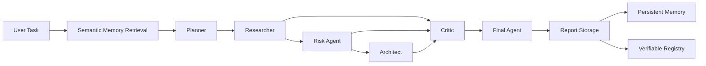

# ClawMind

**Multi-agent AI system for structured due diligence with critic-driven reasoning, semantic memory, MCP access, and verifiable report provenance.**

ClawMind orchestrates specialized AI agents to research a task, identify risks, challenge weak assumptions, and produce a structured decision report.

Web3 due diligence is the current application domain; the core project focuses on **agent orchestration, memory, evaluation, tool interfaces, and verifiable AI workflows**.

**[Live App](https://clawmind-puce.vercel.app)** · **[Demo Video](https://youtu.be/ddJx034yrJw)** · **[Documentation](https://clawmind.mintlify.app)** · **[MCP Server](https://clawmind-mcp.vercel.app/mcp)**

---

## How It Works



The reasoning pipeline separates responsibilities instead of relying on a single monolithic prompt.

The final decision is influenced by the evidence collected by the agents and by unresolved challenges raised by the Critic.

---

## Agent Pipeline

### Planner

Breaks the user task into a structured investigation plan.

### Researcher

Collects and organizes evidence relevant to the task.

### Risk Agent

Identifies technical, operational, governance, and security risks.

### Architect

Evaluates the proposed system or protocol architecture.

### Critic

Challenges assumptions and findings produced by the other agents.

Unresolved critic findings affect the final score rather than being treated as decorative commentary.

### Final Agent

Combines the evidence, risk analysis, architecture review, and critic feedback into a structured recommendation:

```text
GO
INVESTIGATE_MORE
NO_GO
```

---

## Key Engineering Features

- **Multi-agent orchestration** — specialized agents with separated responsibilities.
- **Critic-driven reasoning** — adversarial review can directly affect the final decision.
- **Semantic memory** — previous analyses are embedded and retrieved as context for future runs.
- **Persistent memory** — runtime-generated knowledge can be reused across analyses.
- **Structured outputs** — agent stages exchange structured data instead of relying only on free-form text.
- **MCP interface** — the same analysis pipeline is accessible from MCP-compatible clients.
- **API-first architecture** — analysis, retrieval, verification, and reporting are exposed through application APIs.
- **Verifiable reports** — report provenance and integrity can be independently checked through the storage and registry layer.
- **Automated quality checks** — linting, type checking, unit tests, smart-contract tests, and production builds are part of CI.

---

## Memory

ClawMind uses semantic memory to retrieve relevant information from previous analyses before starting a new reasoning run.

```text
Previous Analyses
       |
       v
   Embeddings
       |
       v
 Semantic Search
       |
       v
Relevant Memory
       |
       v
 Agent Pipeline
```

After an analysis completes, new knowledge can be written back into persistent memory for future runs.

This creates a feedback loop:

```text
Retrieve -> Reason -> Evaluate -> Store -> Retrieve
```

---

## MCP

ClawMind exposes a remote Model Context Protocol server for MCP-compatible clients.

Current tools include:

```text
analyze_web3_project(task)
get_recent_analyses(limit)
```

MCP endpoint:

```text
https://clawmind-mcp.vercel.app/mcp
```

Example configuration:

```json
{
  "mcpServers": {
    "clawmind": {
      "url": "https://clawmind-mcp.vercel.app/mcp",
      "headers": {
        "X-MCP-Client-Id": "demo-client"
      }
    }
  }
}
```

---

## Verification Layer

The AI pipeline is separated from the verification layer.

After the Final Agent produces a report:

```text
Final Report
     |
     +--> Report Storage
     |
     +--> Memory Index
     |
     +--> Signed Registry
```

The current implementation uses 0G infrastructure for inference, storage, and report provenance.

On-chain integrity proves that a particular report hash was recorded; it does **not** prove that the AI-generated conclusion is correct.

---

## Tech Stack

**AI & Agents**

```text
LLM Agents
Agent Orchestration
Semantic Memory
Embeddings
MCP
Structured Outputs
```

**Application**

```text
TypeScript
Next.js
React
REST APIs
Redis
Transformers.js
```

**Infrastructure**

```text
Docker
Vercel
GitHub Actions
```

**Verification**

```text
0G Compute
0G Storage
0G Chain
Solidity
Foundry
EIP-712
```

---

## Quick Start

### Requirements

```text
Node.js >= 18.18
```

### Install

```bash
git clone https://github.com/ILYUTKICK/clawmind.git
cd clawmind

npm install
cp .env.example .env
npm run dev
```

Open:

```text
http://localhost:3000
```

### Docker

```bash
docker build -t clawmind .
docker run --env-file .env -p 3000:3000 clawmind
```

---

## Quality

Run the full application checks:

```bash
npm run ci
```

Validate the MCP server:

```bash
npm run ci:mcp
```

Run smart-contract static analysis and tests:

```bash
npm run audit:contracts
```

The repository includes checks for:

- ESLint
- TypeScript
- production Next.js build
- unit tests
- MCP lint/typecheck/build
- Foundry contract tests
- smart-contract static analysis

---

## Main API

| Endpoint | Purpose |
|---|---|
| `POST /api/analyze` | Runs the analysis pipeline |
| `GET /api/judge` | Returns runtime and verification information |
| `GET /receipt/[analysisId]` | Displays a report verification receipt |
| `GET /api/openclaw/manifest` | Returns the cognitive pipeline manifest |
| `POST /api/report/retrieve` | Retrieves a stored report |

---

## Project Structure

```text
clawmind/
├── app/                 # Next.js application and APIs
├── apps/
│   └── mcp-server/      # Remote MCP server
├── components/          # UI components
├── contracts/           # Verification registry and tests
├── docs/                # Extended technical documentation
├── lib/
│   ├── agents/          # Specialized reasoning agents
│   ├── embeddings/      # Embedding layer
│   ├── memory/          # Semantic and persistent memory
│   ├── orchestrator/    # Agent workflow orchestration
│   ├── storage/         # Report storage
│   └── contracts/       # Verification integration
├── scripts/
├── tests/
├── Dockerfile
└── package.json
```

---

## Limitations

- ClawMind is a decision-support system, not a formal security audit or exploit detector.
- Agent conclusions depend on the quality of available evidence and model reasoning.
- Semantic memory can improve context reuse but can also propagate poor historical information if it is not evaluated.
- Report integrity proves that a specific output was recorded; it does not guarantee factual correctness.
- Systems involving custody, signing keys, protocol upgrades, or automated execution should still use deterministic controls and human approval outside the LLM pipeline.

---

## Documentation

Extended documentation covers:

- system architecture;
- agent responsibilities;
- semantic memory;
- evaluation methodology;
- MCP integration;
- verification and provenance;
- deployment and security.

See [`docs/`](docs/).
