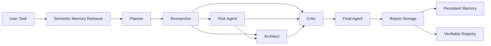

# Architecture

ClawMind is a multi-agent decision-support system. Web3 due diligence is the current application domain, while the core engineering work is centered on agent orchestration, semantic memory, structured reasoning, MCP access, and verifiable report provenance.

## High-Level Flow



The runtime is intentionally split into three concerns:

1. **Reasoning**
   - Planner
   - Researcher
   - Risk Agent
   - Architect
   - Critic
   - Final Agent

2. **Memory**
   - semantic retrieval
   - embeddings
   - persistent memory
   - runtime memory growth

3. **Verification and interfaces**
   - report storage
   - MCP
   - signed registry
   - public verification surfaces

---

## Repository Layers

```text
app/                    Next.js UI and API routes
apps/mcp-server/        Remote MCP server
components/             UI and report visualization
contracts/              Analysis registry and Foundry tests
lib/
  agents/               Specialized reasoning agents
  compute/              Inference provider integration
  contracts/            Registry integration
  embeddings/           Embedding provider
  memory/               Semantic and persistent memory
  metrics/              Runtime metrics
  openclaw/             Pipeline manifest support
  orchestrator/         End-to-end workflow orchestration
  storage/              Report and memory storage
scripts/                 Deployment, audits, tests, warm-up
tests/                   Unit tests
docs/                    Extended documentation
```

---

## Reasoning Layer

### Planner

The Planner receives the user task and relevant retrieved memory. Its purpose is to break the task into a concise execution plan for specialized agents.

### Researcher

The Researcher receives the task and Planner output. It extracts facts, assumptions, missing context, and useful signals that later agents can reason over.

### Risk Agent

The Risk Agent evaluates the task using the research result and relevant memory context.

Its prompt explicitly asks it to identify:

- security risks;
- financial risks;
- autonomy risks;
- privacy risks;
- governance risks;
- data risks;
- infrastructure risks.

### Architect

The Architect receives the task, research output, and risk output when available. It produces practical architecture recommendations and can still operate when the Risk Agent output is not yet available.

### Critic

The Critic is an adversarial review stage rather than a cosmetic summarizer.

It returns structured challenges with:

```text
challenge
severity
explanation
```

Supported severity levels:

```text
low
medium
high
```

The runtime normalizes malformed or partial critic output so the downstream pipeline receives a predictable structure.

### Final Agent

The Final Agent aggregates the evidence and produces the final structured decision.

Current recommendation classes:

```text
GO
INVESTIGATE_MORE
NO_GO
```

The implementation also contains deterministic guard logic for selected high-risk patterns such as custody, signing, oracle, governance, audit, and liquidity signals. This reduces reliance on unconstrained free-form model scoring.

---

## Memory Layer

The memory subsystem is separate from the agent code.

Current components include:

```text
lib/memory/embeddings.ts
lib/memory/memory-manager.ts
lib/memory/persistent-memory-store.ts
lib/embeddings/
```

The semantic retrieval path combines embeddings with fallback lexical signals.

The embedding module uses:

```text
all-MiniLM-L6-v2
384-dimensional vectors
cosine similarity
```

The model is lazy-loaded and cached for the process lifetime.

Persistent memory can use Redis and a stored memory index, allowing previously generated knowledge to survive across analysis runs.

See [memory.md](memory.md) for details.

---

## Verification Layer

The AI reasoning pipeline is kept conceptually separate from report verification.

```text
Final Report
     |
     +--> Report Storage
     |
     +--> Persistent Memory Index
     |
     +--> Signed Registry
```

The current implementation uses 0G infrastructure for inference, storage, and the production registry flow.

The registry is not treated as proof that the model is correct. It only proves that a specific output and associated metadata were recorded.

See [verification.md](verification.md).

---

## Interface Layer

ClawMind exposes the same underlying analysis capability through several interfaces:

- browser UI;
- REST API;
- MCP server;
- public receipt pages;
- verification/statistics endpoints.

This separation lets the reasoning pipeline remain reusable while the calling surface changes.

---

## Architectural Rationale

### Why multiple agents instead of one prompt?

The pipeline separates planning, evidence extraction, risk analysis, architecture review, adversarial challenge, and final decision-making.

This makes intermediate reasoning artifacts inspectable and gives the Critic a clear role rather than asking one model call to perform every task at once.

### Why retrieve memory before planning?

The Planner receives relevant historical context at the beginning of the run. This allows previous analyses to influence planning without hard-coding them into every prompt.

### Why keep a deterministic layer in the final decision path?

LLM outputs can vary. Deterministic checks for high-risk signals provide a second layer for important conditions such as custody and signing controls.

### Why use a separate verification layer?

Reasoning quality and report integrity are different properties.

- The AI layer answers: **What conclusion did the system reach?**
- The verification layer answers: **Was this exact report stored and recorded?**

Keeping them separate avoids treating provenance as factual validation.

### Why expose MCP?

MCP allows external AI clients to call ClawMind as a tool rather than requiring users to interact only through the web application.

---

## Design Principles

1. **Role separation** — each reasoning stage has a narrow responsibility.
2. **Inspectable intermediate outputs** — agent results can be surfaced and reviewed.
3. **Memory reuse** — prior analyses can inform later runs.
4. **Structured contracts** — critical stages use typed/structured outputs where possible.
5. **Adversarial review** — the Critic can materially influence the final result.
6. **Graceful fallback** — memory and infrastructure layers include fallback behavior rather than depending on a single happy path.
7. **Verifiable provenance** — stored reports can be checked independently of the model.
